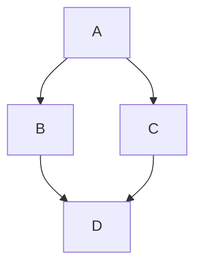
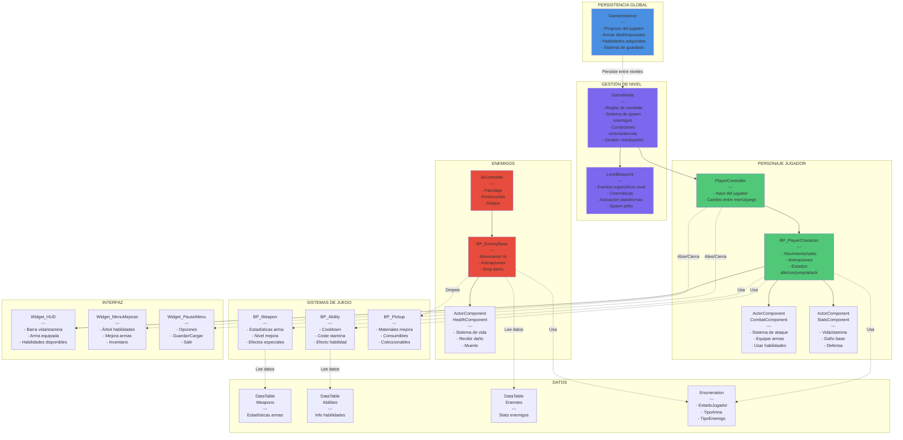

# Normal Markdown Text

normal text

bold -> **bold**

italic -> *italic*

striketrough -> ~~striketrough~~

# Lists

- one
- two
- three

1. one
2. two
3. three

> quote
> quote
> quote

# Headers

# hola
## hola
### hola
#### hola
##### hola
###### hola

# Links

[[Untitled (1)]] 

# Divider
---
# Code

```java
public class Person {
  
  int age;
  String name;
  
  public Person(int age, String name) {

    this.age = age;
    this.name = name;
    
  }

}
```

# Callouts

> [!success] Success
> success

> [!note] Note
> Note

# Terminal callout

> [!terminal]  Person.java
> public class Person {
>    int age;
>    String name;
> 
>    public Person(int age, String name) {
>       this.age = age;
>       this.name = name;
>    }
> }

> [!terminal] script.py
> # Outputting a message to the console
> print("Hello, World!")

>[!terminal] script.rs
>/// Synchronize the vault database with the filesystem.
>///
>/// This command should be called by the frontend after loading the vault path.
>/// It scans all .md files, indexes new/modified files, and removes deleted files.
>#[tauri::command]
>pub async fn sync_vault(
>    state: State<'_, AppState>,
>    vault_path: String,
>) -> Result<SyncResult, String> {
>    let db_guard = state.db.lock().await;
>
>    let db = db_guard.as_ref().ok_or("Database not initialized")?;
>
>    match VaultIndexer::full_sync(db, &vault_path).await {
>        Ok(stats) => {
>            let mut idx_guard = state.file_index.lock().await;
>            *idx_guard = None;
>            Ok(SyncResult::from(stats))
>        }
>        Err(e) => Ok(SyncResult {
>            success: false,
>            files_indexed: 0,
>            files_deleted: 0,
>            files_skipped: 0,
>            duration_ms: 0,
>            error: Some(e),
>        }),
>    }
>}

# Mermaid diagrams





# Table
| Header 1 | Header 2 | Header 3 | Header 4 | Header 5 | Header 6 | Header 7 | Header 8 |
| --- | --- | --- | --- | --- | --- | --- | --- |
|     |     |     |     |     |     |     |     |
|     |     |     |     |     |     |     |     |
|     |     |     |     |     |     |     |     |
|     |     |     |     |     |     |     |     |
|     |     |     |     |     |     |     |     |
|     |     |     |     |     |     |     |     |
|     |     |     |     |     |     |     |     |
> [!info] Slash Command
> You can use the ''/'' key to open a menu that lets the user insert any markdown component supported by the application /


# LaTeX 

Full latex block

$$
\begin{bmatrix}
   \frac{1}{2} & \frac{3}{4} \\
   \int_0^1 x dx & \sum_{n=0}^\infty n
\end{bmatrix}
$$

Inline Latex block $3 + 2 = 5$ for inline math