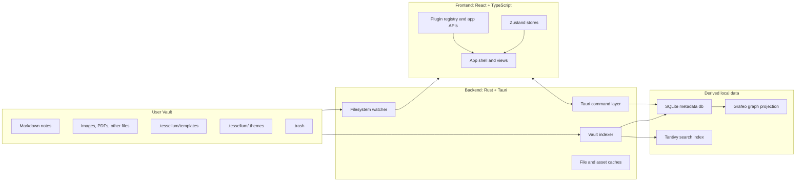

# Tessellum

Tessellum is a local-first knowledge management desktop application built with Tauri, React, TypeScript, and Rust. It keeps notes as plain Markdown inside a user-selected vault, then adds fast local indexing, graph exploration, plugin-driven editing, and deep UI customization on top.

## Table of Contents

- [Why Tessellum](#why-tessellum)
- [Feature Snapshot](#feature-snapshot)
- [Architecture](#architecture)
- [Project Structure](#project-structure)
- [Development](#development)

## Why Tessellum

Tessellum's main strengths come from the way it combines ownership, speed, and extensibility:

- **Local-first by default**. Notes, assets, templates, and custom themes stay on disk in a normal folder structure. The application does not depend on a cloud backend to be useful.
- **Plain Markdown as the source of truth**. The vault remains readable outside the app, which keeps the data portable and durable.
- **Rich knowledge workflows**. The editor supports wiki links, callouts, Mermaid, KaTeX, tables, task lists, inline tags, frontmatter, code blocks, images, and PDF embeds.
- **Two navigation models**. Users can work through a classic file tree and tabs, or switch to a graph view with orphan detection, ghost nodes for broken links, and Cypher-style graph filtering.
- **Fast search and metadata access**. SQLite stores note metadata and relationships, Tantivy powers local full-text search, and backlinks/tags remain cheap to query.
- **Real-time synchronization**. A Rust file watcher listens for vault changes, invalidates runtime caches, and keeps the UI and indexes in sync.
- **Extensible architecture**. Built-in editor behavior is implemented through a plugin registry, and plugins can contribute CodeMirror extensions, command palette entries, settings tabs, UI actions, and sidebar actions.
- **Designed for personal workflows**. Daily notes, templates, safe trash handling, theme scheduling, Vim mode, spellcheck, accessibility controls, localization, and user-defined themes are part of the application model, not afterthoughts.

## Feature Snapshot

### Note-taking and editing

- Markdown notes stored directly in the vault
- Reading, live preview, and source editor modes
- Wiki links with resolution to vault files
- Rich blocks for callouts, Mermaid diagrams, tables, math, inline code, and task lists
- Frontmatter and inline tag support
- Media embeds for images and PDFs
- Slash commands, selection toolbar, tab strip, and command palette

### Navigation and discovery

- Vault file tree with folder-aware operations
- Backlinks, outline, and tag sidebar for the active note
- Full-text search with tag filters and recent searches
- Global graph view plus local graph panel
- Cypher-style query panel over the graph projection

### Workflow and customization

- Template-driven note creation
- Daily note workflow
- Safe trash with restore and timed cleanup
- Theme system with built-in themes plus user themes from the vault
- Appearance, accessibility, language, spellcheck, and plugin settings
- Runtime plugin enable/disable support

## Architecture

Tessellum follows a layered local-first architecture:

- The **vault** is the source of truth for user content.
- The **Rust backend** owns filesystem access, indexing, search, and graph projection.
- The **React frontend** owns interaction, composition, and rendering.
- The **plugin system** extends the editor and UI without forcing features into one monolithic component.

### High-level runtime



### Architectural principles

- **Content and indexes are separated on purpose**. Markdown files stay inside the vault, while operational indexes live in the app data directory. This keeps the vault portable and the runtime fast.
- **The backend is the system boundary**. Filesystem access, indexing, trash behavior, and search/graph maintenance all happen through Rust commands instead of ad hoc frontend reads.
- **Derived data is disposable**. SQLite, Tantivy, and Grafeo are optimized views of vault content, not the authoritative data format.
- **State is split by responsibility**. Instead of one giant client store, Tessellum uses focused Zustand slices for vault state, UI state, graph state, editor content, search readiness, appearance, settings, and plugins.
- **Features prefer extension points over hard coupling**. Built-in editor features are loaded through the same plugin runtime that third-party features can use.

### Frontend layer

The frontend lives in `src/` and is responsible for user interaction, view orchestration, and plugin-aware composition.

- `src/App.tsx` wires the application shell, restores workspace state, starts vault watching, warms the search index, and coordinates editor, graph, and settings surfaces.
- `src/components/` contains the major views: editor, sidebar, title bar, search panel, graph view, command palette, settings modal, trash modal, and layout helpers.
- `src/stores/` contains specialized Zustand stores such as `vaultStore`, `editorContentStore`, `graphStore`, `searchStore`, `appearanceStore`, `settingsStore`, and `pluginsStore`. This keeps client state focused and easier to reason about.
- `src/plugins/` contains the frontend extension runtime. `TessellumApp` exposes app-level APIs, `PluginRegistry` manages lifecycle, and the API classes provide stable surfaces for editor, vault, workspace, command, UI, and i18n integration.
- `src/i18n/`, `src/themes/`, and `src/features/clipboard/` hold cross-cutting concerns that are intentionally separated from the main UI tree.

### Backend layer

The backend lives in `src-tauri/src/` and handles filesystem coordination, indexing, persistence, search, and graph data.

- `lib.rs` starts the Tauri runtime, initializes local data stores, registers commands, and sets up shared `AppState`.
- `commands/` exposes the backend surface consumed by the frontend: notes, vault operations, templates, links, watcher, graph, search, clipboard, folders, and assets.
- `db.rs` manages the SQLite database used for indexed notes, links, search file metadata, and normalized tags.
- `indexer.rs` scans the vault, parses Markdown metadata, extracts wiki links and tags, updates SQLite, and batches documents into Tantivy.
- `search.rs` manages full-text search, tag search, search readiness checks, and index rebuild logic.
- `grafeo_projection.rs` projects notes and links into a graph database so the graph view can support richer query workflows.
- `trash.rs` implements trash naming, restore behavior, collision handling, and retention cleanup.
- `models/app_state.rs` holds shared runtime resources such as the watcher, database handle, search index, and in-memory file and asset caches.

### Persistence model

Tessellum uses two storage scopes:

| Scope | Location | Purpose |
| --- | --- | --- |
| Vault-owned data | User-selected vault | Markdown notes, folders, assets, `.tessellum/templates`, `.tessellum/.themes`, and `.trash` |
| App-owned data | Tauri app data directory | `vault.db`, `search_index/`, `graph.grafeo`, and startup diagnostics |

This split matters because it keeps user content portable while allowing the app to maintain fast local indexes and caches.

### Data flow and synchronization

The normal runtime loop looks like this:

1. The user opens a vault from the frontend.
2. The frontend calls `set_vault_path`, which expands Tauri file scopes and triggers trash retention cleanup for that vault.
3. The frontend starts `watch_vault`, fetches the flat file list and file tree, restores UI state, and starts periodic or on-demand sync.
4. The Rust indexer scans the vault, ignores hidden/special paths, parses frontmatter, extracts inline tags and wiki links, and updates SQLite.
5. The same sync path batches searchable documents into Tantivy.
6. Grafeo receives a projection of notes and links so the graph view can query relationships efficiently.
7. When the filesystem watcher emits `file-changed`, the frontend refreshes visible state and triggers another debounced sync cycle.

This gives Tessellum a useful architecture property: **the vault can change from inside or outside the app, and the runtime still converges back to a consistent local model**.

### Search architecture

Search is not just a text box layered over files:

- SQLite tracks indexed files and note metadata.
- Tantivy stores the searchable document index.
- The frontend keeps a dedicated `searchStore` with readiness state and recent searches.
- On vault open or search activation, the frontend asks the backend to ensure the search index is ready.
- The backend can rebuild the search index if the expected Markdown set and the actual Tantivy index drift apart beyond a threshold.

This makes search startup more resilient while keeping the user-facing interaction simple.

### Graph architecture

The graph experience is built from two layers:

- **SQLite relationship layer**: the note/link index is used to build the standard graph data shown in the UI, including orphan detection and ghost nodes for broken targets.
- **Grafeo query layer**: the same note/link model is projected into a graph database so users can run Cypher-style queries from the graph panel.

That split keeps the default graph view cheap while still enabling advanced filtering workflows.

### Plugin and extension architecture

One of the strongest parts of the project is that built-in rich editor behavior is implemented as plugins rather than hard-coded branches.

- `TessellumApp` is the frontend singleton that exposes app-wide APIs and an event bus.
- `PluginRegistry` owns plugin lifecycle, enable/disable state, and load error isolation.
- `EditorAPI` gives each plugin its own CodeMirror compartment so extensions can be configured independently.
- `WorkspaceAPI` lets plugins interact with notes and navigation without importing Zustand stores directly.
- `UIAPI` lets plugins contribute command palette entries, settings tabs, title bar actions, sidebar actions, and custom callout types.

Built-in plugins currently cover capabilities such as markdown preview, math, inline code, callouts, tables, wiki links, code blocks, Mermaid, frontmatter, inline tags, daily notes, media embedding, media paste, task lists, and core UI actions.

## Project Structure

| Path | Responsibility |
| --- | --- |
| `src/` | Frontend application |
| `src/components/` | UI surfaces such as editor, graph, search, settings, sidebars, and layout |
| `src/stores/` | Focused Zustand state slices |
| `src/plugins/` | Plugin runtime, event bus, manifests, and frontend APIs |
| `src/features/clipboard/` | Clipboard import/export workflow |
| `src/i18n/` | Localization resources and i18n service |
| `src/themes/` | Theme tokens, built-in themes, and theme parsing |
| `src/utils/` | Shared frontend utilities for graph mapping, notes, paths, tags, and outline parsing |
| `src-tauri/src/commands/` | Tauri command handlers for backend features |
| `src-tauri/src/models/` | Shared backend runtime types and caches |
| `src-tauri/src/db.rs` | SQLite persistence layer |
| `src-tauri/src/indexer.rs` | Vault scan and indexing pipeline |
| `src-tauri/src/search.rs` | Search readiness and full-text/tag search |
| `src-tauri/src/grafeo_projection.rs` | Graph projection and query integration |
| `src-tauri/src/trash.rs` | Trash lifecycle and retention logic |
| `.github/workflows/` | CI and release automation |

## Development

### Prerequisites

- Node.js 20+
- Rust stable
- Tauri prerequisites for your operating system

### Run locally

```bash
npm install
npm run tauri dev
```

### Build production bundles

```bash
npm run tauri build
```

### Frontend-only build

```bash
npm run build
```

### CI and release pipeline

- `.github/workflows/tauri-ci.yml` builds bundles on Windows, macOS, and Ubuntu.
- `.github/workflows/tauri-release.yml` publishes release assets for tagged versions.

---

Tessellum is strongest when viewed as more than a note editor: it is a local-first Markdown workspace with a deliberate indexing pipeline, a graph-aware backend, and a plugin-oriented frontend that is structured to grow without collapsing into one oversized application module.
