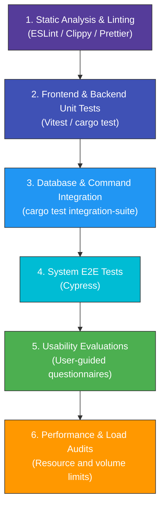

# Tessellum Testing Plan Specification Aligned with UNE 157801

## 4.2.2.6 Testing Plan (Plan de Pruebas)

The software testing process is an essential engineering discipline that extends throughout the entire lifecycle of software construction. In the development of Tessellum, testing is not a post-construction validation phase but a continuous activity integrated into every stage of development (following Test-Driven Development principles for core utility models and backend schemas, component-driven testing for UI states, and end-to-end regression integration gates).

This specification outlines how designed test cases are systematically applied to the software and introduces additional validation methodologies (specifically Usability and Performance testing) necessary to ensure high quality, reliability, and excellent user experience.

### Testbed Environment (Entorno de Pruebas)
To guarantee the consistency and reproducibility of all test executions, the automated and manual testing processes are conducted under a standardized host machine configuration:
- **Operating System (OS)**: Microsoft Windows 11 Professional (64-bit, Version 22H2 / Build 22621 or higher).
- **Processor (CPU)**: Intel Core i7 (10th Generation or higher) or AMD Ryzen 7 (4000 series or higher).
- **Memory (RAM)**: 16 GB DDR4/DDR5 or higher.
- **Storage**: Solid State Drive (SSD) with at least 10 GB of free space.
- **Development Environment & Toolchain**:
  - *Integrated Development Environment (IDE)*: Visual Studio Code (Version 1.88 or higher).
  - *Runtime Environment*: Node.js (Version 20 LTS or higher) and npm (Version 10 or higher).
  - *System Compiler*: Rust Compiler and Cargo toolchain (Version 1.75 Stable or higher).
  - *Desktop Framework*: Tauri CLI (Version 1.6 or higher) utilizing Microsoft Edge WebView2 as the frontend rendering engine on Windows.
  - *E2E Test Suite*: Cypress (Version 13 or higher) running in a standardized Chromium-based browser context.

### Multi-Process / Localhost Architecture Note
Although Tessellum is structured as a multi-process architecture where independent runtime components collaborate (comprising a React-based frontend client running inside a WebView2 rendering window, a Rust-based backend core controller process executing system commands, a local SQLite embedded database operating in Write-Ahead Logging (WAL) mode, a Tantivy full-text search engine indexer, and a Grafeo graph projection memory cache), **all testing is executed on a single host machine**. 

Inter-process communication (IPC) between the frontend client and the backend server is achieved via the local Tauri IPC bridge, which maps directly to safe, isolated local system calls. Database reads, Tantivy indexing, and Grafeo graph constructions are bounded entirely within temporary system directories on `localhost`, preventing network dependency or external environment noise during test runs.

### Test Execution Sequence (Orden de Ejecución)
Tests are executed in a strict, hierarchical order within both local development environments and the Continuous Integration (CI) pipeline, ensuring that basic building blocks are validated before complex integration paths are exercised:

---

### 4.2.2.6.1 Unit Testing (Pruebas Unitarias)

Unit tests validate the correct functioning of individual modules in isolation. Each unit test targets a single class, function, or store that fulfills a concrete responsibility. The purpose is to ensure that every module functions correctly by itself before it participates in larger component assemblies.

#### Subsystem Division and Implementation Details
Now that the technical design is complete, all classes and modules within Tessellum's subsystems are clearly defined. Unit testing is strictly divided between the two primary subsystems of the application:
1. **Frontend Subsystem (React / TypeScript)**:
   - *Target Modules*: Pure Zustand state stores (`settingsStore.ts`, `editorContentStore.ts`), layout modals (`InputModal.tsx`, `DeleteConfirmModal.tsx`), hook decision paths (`useDeleteFile.ts`), and editor parsing algorithms (`markdownShortcuts.ts`).
   - *Data Inputs*: Test data comprises structured state snapshots, trimmed and untrimmed strings, font sizes (px boundaries), and cursor/selection positions.
   - *Execution Framework*: **Vitest** combined with **React Testing Library (RTL)** and a virtual **jsdom** environment. This setup allows rendering UI components and executing store transitions in memory without running the compiled desktop wrapper.
2. **Backend Subsystem (Rust / Tauri Core)**:
   - *Target Modules*: Path security filters (`validate.rs`), trash lifecycle managers (`trash.rs`), search query Normalizer helpers (`search.rs`), and database utilities (`db.rs`).
   - *Data Inputs*: Mock filesystem directories, invalid paths (e.g., path traversal attempts using `..`), database schema rows, and search tokens.
   - *Execution Framework*: **`cargo test`** using isolated Rust unit-test modules marked with `#[cfg(test)]`.

#### Triggers, Correction Measures, and Regression Strategy
- **When Performed**: Unit tests are run locally by developers during editing (facilitated by Vitest's active watcher mode and `cargo watch`) and are automatically triggered in the central GitHub Actions repository upon every commit and Pull Request.
- **Failures & Correction Measures**: If a unit test fails, the CI/CD pipeline blocks the code merge. A high-priority defect entry is logged, tracing back to the affected component. The developer must refactor the code locally, verify the fix by running the unit test, and commit the update.
- **Regression Testing Strategy**: To prevent regression, these unit tests are fully automated. Every time a major system change occurs, the entire suite is executed to ensure that previously completed features remain operational. Vitest's coverage utility (`c8` / `istanbul`) ensures that coverage boundaries do not drop below specified thresholds.

---

#### Functional Use Case Testing Coverage (Cobertura de Casos de Uso)

Unit testing directly validates the core behaviors, utility paths, and state transitions of the **14 System Use Cases (Casos de Uso del Sistema)** defined in the System Analysis Chapter of the project specification (specifically, in the thesis System Requirements Analysis document). Rather than reproducing the exhaustive testing scenario matrices here, the unit tests are mapped directly 1:1 to the basic, alternative, and error paths of these 14 functional bounds, isolating the individual React components, custom hooks, Zustand stores, and Rust backend modules involved:

- **CU1: Manage Vault (Gestionar Bóveda)**:
  - *Target Scenarios*: Opening a vault, listing flat directories, reordering/persisting vault tabs in Zustand, and avoiding duplicates.
  - *Testing Scope*: Verifying that `vaultStore` initializes cleanly, populates the file list, and handles tab switching and fallback correctly.
- **CU2: Manage Notes (Gestionar Notas)**:
  - *Target Scenarios*: Note creation, editing content, renaming, deleting, and handling path collisions.
  - *Testing Scope*: Validating that note writes trigger background index updates and database entries, names are trimmed of leading/trailing spaces, and invalid or duplicate names are resolved safely.
- **CU3: Manage Folders (Gestionar Carpetas)**:
  - *Target Scenarios*: Directory creation and structure synchronization.
  - *Testing Scope*: Checking that duplicate folder names are blocked, and names containing invalid OS characters are properly sanitized.
- **CU4: Search Notes (Buscar Notas)**:
  - *Target Scenarios*: Full-text keyword searches, recent queries caching, and index readiness synchronization.
  - *Testing Scope*: Testing query parsing, multi-token lookups with filters (e.g. `content:graph #feature`), and ensuring concurrent search requests are coalesced into a single backend thread.
- **CU5: Manage Trash (Gestionar Papelera)**:
  - *Target Scenarios*: Trashing notes/folders, parsing timestamp suffixes, restoring deleted files, and purging expired items.
  - *Testing Scope*: Verifying that trashed notes are pruned from active trees, name collisions on restore receive unique suffixes, and the 30-day retention boundary is enforced exactly down to millisecond precision.
- **CU6: Manage Settings (Gestionar Ajustes)**:
  - *Target Scenarios*: Locale switching, adjustments to editor font sizing, and accessibility configuration (high contrast/spellchecking).
  - *Testing Scope*: Verifying font size clamping between `12px` and `24px`, checking locale fallbacks to English on unsupported inputs, and safeguarding against corrupted `localStorage` configurations.
- **CU7: Manage Themes (Gestionar Temas)**:
  - *Target Scenarios*: Loading custom JSON themes and scheduling theme switches (system sync, sunrise/sunset, custom hours).
  - *Testing Scope*: Validating theme validation schemas, scheduling boundaries, and fallback theme selections during database or system failures.
- **CU8: Manage Plugins (Gestionar Plugins)**:
  - *Target Scenarios*: Dynamic registration, enabling/disabling, and cleanup of plugin bundles.
  - *Testing Scope*: Auditing the `TessellumApp` and `PluginRegistry` lifecycles, ensuring plugin errors do not crash other subsystems, and verifying full command/UI cleanup on disabling.
- **CU9: Manage the Editor (Gestionar el Editor)**:
  - *Target Scenarios*: Formatting markdown shortcuts (bold/italic/lists), slash commands (`/`), and autocomplete suggestions.
  - *Testing Scope*: Testing list toggles on multi-line text blocks, slash command context parses, and case-insensitive suggestions filtering.
- **CU10: Validate Paths and Inputs (Validar Rutas e Entradas)**:
  - *Target Scenarios*: Restricting file paths inside the vault and sanitizing filenames.
  - *Testing Scope*: Preventing directory traversal attacks (blocking `..` or external system paths in `validate_path_in_vault`) and stripping invalid operating system path characters.
- **CU11: Manage the Knowledge Graph (Gestionar el Grafo de Conocimiento)**:
  - *Target Scenarios*: Note indexing, link extraction, and graph data queries.
  - *Testing Scope*: Validating wiki-link syntax extraction (including aliased and escaped forms), mapping backlink tables, and handling orphan notes or ghost nodes for missing targets.
- **CU12: Manage the Internationalisation Service (Gestionar el Servicio de Internacionalización)**:
  - *Target Scenarios*: Looking up translations and registering plugin bundles.
  - *Testing Scope*: Throwing error keys in development mode for missing keys and enforcing English bundle requirements in custom plugins.
- **CU13: Clipboard Operations (Operaciones del Portapapeles)**:
  - *Target Scenarios*: Copying/pasting notes and importing files.
  - *Testing Scope*: Auditing clipboard write signals, handling write errors safely with UI toasts, and incrementing name suffixes on paste conflicts.
- **CU14: Export to PDF (Exportar a PDF)**:
  - *Target Scenarios*: Printing markdown notes with styling, bookmarks outline extraction, and saving.
  - *Testing Scope*: Validating outline trees generated by `parseOutline`, safeguarding against empty destination paths, and managing WebView print failures.

---

### 4.2.2.6.2 Integration and System Testing (Pruebas de Integración y del Sistema)

While unit testing targets software components in isolation, **Integration and System Testing** verifies that groups of components function correctly when combined, and that the compiled application behaves perfectly under end-to-end user flows.

#### Application and Methodology (How and When)
1. **Integration Testing**:
   - *Methodology*: Focuses on the transactional pipelines where the frontend, Rust IPC commands, SQLite database schema, Tantivy search indexer, and Grafeo graph projection intersect. Integration tests are implemented using Rust integration tests running against temporary vault structures created dynamically.
   - *Inputs & Outputs*: Inputs consist of real, physical file system writes, DB schema upgrades, and rapid file bursts. Outputs are verified SQLite rows, coherent index states, and mapped Graph models.
   - *Execution Trigger*: Run automatically via `cargo test` in both development environments and during pre-merge validation.
2. **System Testing (E2E)**:
   - *Methodology*: Verifies end-to-end user journeys by executing the complete frontend and interface flows. Since Tessellum is built as a web-first desktop application using Tauri, the E2E suite is implemented using **Cypress** as the primary orchestrator. To facilitate fast and robust automation without OS-level desktop window overhead, tests are run under E2E configuration (`cross-env VITE_E2E=1`) against the local React web server (running at `http://localhost:3000`). Native Tauri interfaces (such as filesystem access, file dialogs, and native commands) are mocked dynamically at the boundary via custom Cypress commands, simulating complete frontend-backend system integration.
   - *Inputs & Outputs*: Inputs are simulated user interactions (clicks, drag-and-drop actions, editor content entries, settings adjustments) and mock vault file structures loaded via `cy.openVault`. Outputs are verified UI updates, correct state changes in Zustand stores, valid Markdown rendering, and Cytoscape graph projections.
   - *Execution Trigger*: Triggered via `npm run e2e` automatically on every commit in the CI/CD pipeline and available interactively via `npm run e2e:open` for developer testing.

#### Outcomes, Error Handlings, and Regression Protection
- **Successful outcome**: Cypress validates DOM assertions, component configurations, and mock IPC actions. The suite completes successfully, generating automated execution summaries.
- **Failing outcome**: In case of assertion failure, Cypress automatically captures:
  1. A full high-resolution screenshot at the exact millisecond of failure.
  2. A detailed execution log including command history, stub outputs, and console warning states.
  3. Video recordings of the test execution (when configured) to assist visual debugging.
  A developer reviews the Cypress dashboard logs, reproduces the failure locally by opening the interactive test runner (`npm run e2e:open`), corrects the underlying defect, and re-runs the spec to guarantee regression clearance.

---

#### Integration Use Case Testing Coverage (Cobertura de Integración)

Integration testing verifies that multiple subsystems (React UI state, Tauri IPC commands, SQLite database schemas, Tantivy indexing threads, and Grafeo graph buffers) operate as an integrated unit. Rather than repeating identical use cases, the integration suite maps directly to the **7 major transactional pipelines** defined by the collaborative scenarios of the Requirements Analysis Phase:

- **CU1: Manage Vault (Vault Watcher & Sync Pipeline)**:
  - *Scope*: Verifies that file modifications, deletions, or external creation bursts are captured by the recursive watcher, parsed correctly, and synchronized sequentially with SQLite and Tantivy indices.
- **CU2: Manage Notes (Save & Metadata Pipeline)**:
  - *Scope*: Verifies the complete write path: saving notes commits SQLite rows, extracts tag collections, resolves outgoing links, rebuilds search docs, and maps graph nodes incrementally.
- **CU3: Manage Trash (Trash-and-Restore Lifecycle)**:
  - *Scope*: Validates that file deletions, trash directory writes, and name-collision suffix additions operate correctly across both the frontend store and the OS filesystem.
- **CU4: Search Notes (Search Readiness & Full-Text Search)**:
  - *Scope*: Verifies that the full-text search pipeline remains stable during cold starts, search queries are executed directly against Tantivy files, and deleted notes are safely excluded from the active result list.
- **CU5: Visualise the Knowledge Graph (Graph Projection Pipeline)**:
  - *Scope*: Verifies that Cytoscape and the frontend graph store accurately map note modifications, duplicate links are deduplicated, and broken wiki-links generate ghost nodes in the model.
- **CU6: Manage Settings (Appearance & Spellcheck Propagation)**:
  - *Scope*: Verifies that changes in settings values are propagated immediately as DOM CSS variables and DOM element attribute adjustments throughout all active editor view panels.
- **CU7: Export to PDF (Frontend-Backend Export Flow)**:
  - *Scope*: Verifies the complete export path: active themes are compiled to high-fidelity print CSS stylesheets, head outline trees are mapped, and the compiled HTML is rendered into a PDF document via Rust's headless exporter.

---

#### System Use Case Testing Coverage (Cobertura del Sistema)

System testing (E2E) validates the absolute interface coherence and overall operational flow of Tessellum under mock user environments. The automated Cypress test suite is organized into **3 specialized testing specs** which exercise all critical user journeys defined in the Analysis Phase:

- **E2E-001: Note Lifecycle Journey (`note-lifecycle.cy.ts`)**:
  - *Scope*: Boots from a seeded vault, clicks buttons to create notes (handling automatic duplication increments like `Untitled` and `Untitled (1)`), opens specific notes in the editor, right-clicks folders to delete notes to the Trash, and validates full restoration and tree updates.
- **E2E-002: Search and Graph Discovery Journey (`search-and-graph.cy.ts`)**:
  - *Scope*: Seeds multiple test files containing tag metadata, executes queries in the search box, filters results dynamically, and validates cytoscape canvas interactive linking (drawing connections for wiki-links and mapping ghost nodes).
- **E2E-003: Settings Persistence Journey (`settings-persistence.cy.ts`)**:
  - *Scope*: Operates settings toggles, switches themes, adjusts editor configurations, and asserts that settings persist correctly across UI updates and reloads.

---

### 4.2.2.6.3 Usability Testing (Pruebas de Usabilidad)

Usability testing is a crucial verification method in Tessellum. Since software developers may be overly familiar with the application's shortcuts and flows, real-world evaluations determine whether final users can operate the system intuitively. The goals of usability testing are:
1. **To enhance the quality of human-computer interaction**: Ensuring the interface layout, colors, typography, and controls feel premium, consistent, and easy to interpret.
2. **To validate self-reported usability and user productivity**: Validating that note-taking, searching, linking, and exporting require minimal clicks and cognitive load, establishing a seamless typing and navigation flow.

#### Usability Elements

##### Users (Participant Profiles)
Tests are performed across three distinct groups of target users, ensuring representative feedback:
- **Profile A (Casual Note-Taker)**: Users with low-to-medium digital application experience. They have no prior familiarity with Markdown or graph-based structures, using simple plain-text notes. They look for absolute ease of use and zero learning curve.
- **Profile B (Regular Developer)**: Users with high technical knowledge and regular experience using basic Markdown syntax. They expect standard keyboard shortcuts, fast typing responsiveness, and high functional reliability.
- **Profile C (Knowledge-Graph Power User)**: Advanced users highly familiar with network-oriented knowledge management tools (e.g., Obsidian, Roam Research). They seek fast slash commands, advanced wiki-linking, complex queries, and deep visualization interactions.

##### Location & Setup (Test Environment)
To ensure realistic usage, tests are conducted in a **strictly remote, unsupervised environment (entorno remoto y no supervisado)**. Users download the compiled application installer and execute the guided tasks directly on their personal Windows 11 machines. This enables high-fidelity feedback regarding:
- Genuine local file performance and hardware interaction.
- Platform-specific installation, WebView loading speeds, and database bootstrapping.
- Usability under real-world home or office distraction levels, without the pressure of an active observer.

##### Methodology (Step-by-Step Procedure)
The remote usability testing relies on a highly structured **three-step asynchronous methodology**:
1. **Step 1: Onboarding and Background Survey**: The participant receives a digital link containing the download package, general goals of Tessellum, and the Evaluation Questionnaire. They complete **Section 1 (Participant Background)** to establish age range and prior tool familiarity.
2. **Step 2: Independent Exploration & Task Execution**: The participant is given a guided checklist of **twelve representative tasks (Actividades Guiadas)** to complete within the app at their own pace. They explore the system independently without real-time external guidance.
3. **Step 3: Self-Reported Usability Survey**: Immediately after task completion, the participant fills out **Section 2 through Section 6** of the Evaluation Questionnaire, grading the workflows on Likert-scale questions, recording self-reported errors or difficulties, and suggesting visual or functional improvements.

---

#### 4.2.2.6.3.1 Questionnaire Design (Diseño de Cuestionarios)
Usability questionnaires are systematically designed to extract both quantitative ratings (enabling statistical aggregation) and qualitative remarks (identifying specific interface weaknesses). 
The questionnaire comprises a four-part structure:
1. **Demographic & Tech Background (Section 1)**: Establishes the user’s baseline capability.
2. **Guided Actions Checklist (Section 2 & 3)**: Evaluates completion success and workflow ease.
3. **General Usability Matrix (Section 4)**: Employs a standardized Likert scale (from 1: Strongly Disagree to 5: Strongly Agree) to measure learnability, consistency, confidence, and recovery from errors.
4. **Qualitative Open Observations & Final Scores (Section 5 & 6)**: Encourages users to voice friction points, confusion, features they would modify, overall ratings, and recommendations.

---

#### 4.2.2.6.3.2 Evaluation Questionnaire (Cuestionario de Evaluación)

The usability questionnaire is delivered to participants digitally to gather user background, workflow impressions, general usability ratings, and detailed suggestions. This questionnaire comprises exactly 43 items structured into 6 sections:

##### Section 1: Participant Background (Perfil del Participante)
This section captures the user's demographic profile, digital literacy, and familiarity with Markdown and graph-based tools.
1. **What is your age range?**
   - [ ] Under 18
   - [ ] 18-24
   - [ ] 25-34
   - [ ] 35-44
   - [ ] 45-54
   - [ ] 55 or older
2. **How would you describe your general level of experience with digital applications?**
   - [ ] Very low
   - [ ] Low
   - [ ] Medium
   - [ ] High
   - [ ] Very high
3. **How often do you use note-taking or knowledge management applications?**
   - [ ] Never or almost never
   - [ ] Occasionally
   - [ ] Weekly
   - [ ] Several times per week
   - [ ] Daily
4. **Before using Tessellum, how familiar were you with Markdown?**
   - [ ] Not familiar at all
   - [ ] Slightly familiar
   - [ ] Moderately familiar
   - [ ] Very familiar
   - [ ] Expert
5. **Before using Tessellum, how familiar were you with graph-based knowledge tools?**
   - [ ] Not familiar at all
   - [ ] Slightly familiar
   - [ ] Moderately familiar
   - [ ] Very familiar
   - [ ] Expert

##### Section 2: Application Usage Overview (Visión General del Uso de la Aplicación)
This section tracks how long and what parts of the application the user explored, as well as any errors encountered.
6. **Approximately how long did you use Tessellum before answering this questionnaire?**
   - [ ] Less than 15 minutes
   - [ ] 15-30 minutes
   - [ ] 30-60 minutes
   - [ ] 1-2 hours
   - [ ] More than 2 hours
7. **Which parts of the application did you try? (Select all that apply)**
   - [ ] Note creation and editing
   - [ ] File or note navigation
   - [ ] Search
   - [ ] Graph view
   - [ ] Settings and customization
   - [ ] Other (please specify): __________
8. **Did you feel that you explored enough of the application to form an opinion about it?**
   - [ ] Yes
   - [ ] Partially
   - [ ] No
9. **Did you encounter any technical problems while using the application?**
   - [ ] No
   - [ ] Yes, a few minor problems
   - [ ] Yes, several problems
   - [ ] Yes, serious problems
10. **If you encountered technical problems, briefly describe them:**
    `[Free text response]`

##### Section 3: Workflow Evaluation (Evaluación de Flujos de Uso)
*Please rate the following statements based on your experience from 1 (Strongly Disagree) to 5 (Strongly Agree):*
* 1 = Strongly disagree
* 2 = Disagree
* 3 = Neither agree nor disagree
* 4 = Agree
* 5 = Strongly agree

11. **Creating a new note was easy.**
    `[Rating: 1 | 2 | 3 | 4 | 5]`
12. **Editing note content was intuitive.**
    `[Rating: 1 | 2 | 3 | 4 | 5]`
13. **Moving between notes, panels, or sections of the application was clear.**
    `[Rating: 1 | 2 | 3 | 4 | 5]`
14. **The search functionality was easy to understand and use.**
    `[Rating: 1 | 2 | 3 | 4 | 5]`
15. **The graph view was useful and understandable.**
    `[Rating: 1 | 2 | 3 | 4 | 5]`
16. **The settings and customization options were easy to find and understand.**
    `[Rating: 1 | 2 | 3 | 4 | 5]`
17. **The organization of the interface helped me know where to go next.**
    `[Rating: 1 | 2 | 3 | 4 | 5]`
18. **I was able to complete the main tasks I wanted to do without major difficulty.**
    `[Rating: 1 | 2 | 3 | 4 | 5]`
19. **The application gave enough feedback when I performed actions.**
    `[Rating: 1 | 2 | 3 | 4 | 5]`
20. **When something was unclear, I was still able to figure out what to do.**
    `[Rating: 1 | 2 | 3 | 4 | 5]`

##### Section 4: General Usability Assessment (Evaluación General de la Usabilidad)
*Please rate the following statements based on your experience from 1 (Strongly Disagree) to 5 (Strongly Agree):*
* 1 = Strongly disagree
* 2 = Disagree
* 3 = Neither agree nor disagree
* 4 = Agree
* 5 = Strongly agree

21. **The application was easy to learn.**
    `[Rating: 1 | 2 | 3 | 4 | 5]`
22. **The interface was visually clear and understandable.**
    `[Rating: 1 | 2 | 3 | 4 | 5]`
23. **The names, labels, and options used in the application were easy to understand.**
    `[Rating: 1 | 2 | 3 | 4 | 5]`
24. **The application behaved in a consistent way across different sections.**
    `[Rating: 1 | 2 | 3 | 4 | 5]`
25. **I felt confident while using the application.**
    `[Rating: 1 | 2 | 3 | 4 | 5]`
26. **The application allowed me to work efficiently.**
    `[Rating: 1 | 2 | 3 | 4 | 5]`
27. **It was easy to recover from mistakes or understand what went wrong.**
    `[Rating: 1 | 2 | 3 | 4 | 5]`
28. **The application met my expectations in terms of usability.**
    `[Rating: 1 | 2 | 3 | 4 | 5]`
29. **Overall, I am satisfied with the experience of using the application.**
    `[Rating: 1 | 2 | 3 | 4 | 5]`

##### Section 5: Difficulties, Problems, and Improvement Opportunities (Dificultades, Problemas y Oportunidades de Mejora)
This section captures open qualitative feedback on roadblocks, confusion, unexpected behaviors, and desired features.
30. **What parts of the application did you find most difficult to use? Why?**
    `[Free text response]`
31. **What parts of the application were hard to understand?**
    `[Free text response]`
32. **Were there any features, controls, or options that were confusing?**
    `[Free text response]`
33. **Did anything fail, behave unexpectedly, or not work as you expected?**
    `[Free text response]`
34. **What would you change first if you could improve the application?**
    `[Free text response]`
35. **What aspects of the application should be improved to make it easier to use?**
    `[Free text response]`
36. **Was there any moment when you felt lost or unsure about what to do next? Please explain:**
    `[Free text response]`
37. **What feature or aspect of the application did you find most useful or valuable?**
    `[Free text response]`
38. **What feature or aspect of the application did you find least useful?**
    `[Free text response]`
39. **Do you have any suggestions to make the application more intuitive or easier to understand for new users?**
    `[Free text response]`

##### Section 6: Final Assessment (Valoración Final)
This section summarizes the overall user experience and long-term user retention / recommendation likelihood.
40. **How would you rate your overall experience with Tessellum?**
   - [ ] Very poor
   - [ ] Poor
   - [ ] Acceptable
   - [ ] Good
   - [ ] Excellent
41. **Would you use this application again?**
   - [ ] Definitely not
   - [ ] Probably not
   - [ ] Maybe
   - [ ] Probably yes
   - [ ] Definitely yes
42. **Would you recommend this application to other users?**
   - [ ] Definitely not
   - [ ] Probably not
   - [ ] Maybe
   - [ ] Probably yes
   - [ ] Definitely yes
43. **Any final comments?**
    `[Free text response]`

---

#### 4.2.2.6.3.3 Usability Test Activities (Actividades de las Pruebas de Usabilidad)

##### 4.2.2.6.3.3.1 Pre-Test Stage and Instructions
Prior to executing tasks, the participant downloads and installs the application, accepts the evaluation parameters, and completes **Section 1 (Participant Background)** of the Evaluation Questionnaire (4.2.2.6.3.2).

##### 4.2.2.6.3.3.2 Guided Activities
*Please perform the following twelve activities in order. If you feel stuck at any point, make a note of it in the open-ended feedback section of your evaluation survey.*

- **Task 1: Open a Vault**
  - *Action*: Launch the application, click on the `"Open Vault"` button in the setup interface, and select the provided test folder directory.
- **Task 2: Create a Folder Structure**
  - *Action*: In the sidebar file tree, create a new folder named `"Project Alpha"`.
- **Task 3: Create a New Note**
  - *Action*: Inside `"Project Alpha"`, create a new Markdown note named `"Meeting Notes"`.
- **Task 4: Write Standard Markdown Syntax**
  - *Action*: Open the editor and write a header (`# Project Alpha`), a subheader (`## Discussion Points`), bold text (`**Urgent**`), and a bulleted list containing three items.
- **Task 5: Insert Code Block and Quote**
  - *Action*: In the same note, insert a block of Java code under a standard markdown code block and add an indented blockquote.
- **Task 6: Insert Specialized Callouts**
  - *Action*: Create an informational callout (`> [!note] Notes`) and a console-styled terminal box (`> [!terminal] run.sh`) showing a sample command line.
- **Task 7: Use Slash Commands `/`**
  - *Action*: Start a new line, press `/` on your keyboard, select `"Mermaid Diagram"` from the dropdown popover, and verify that the graph flowchart templates render.
- **Task 8: Create Wiki-Links**
  - *Action*: Write a wiki-link pointing to another note (`[[Action Items]]`) and save the note. Click the wiki-link to create and open the target note.
- **Task 9: Navigate the Knowledge Graph**
  - *Action*: Open the interactive `"Graph View"` from the sidebar, verify the connection line between `"Meeting Notes"` and `"Action Items"`, and zoom/pan using the mouse.
- **Task 10: Delete a Note**
  - *Action*: Right-click `"Action Items"`, select `"Move to Trash"`, and confirm the deletion. Verify that it disappears from the sidebar tree.
- **Task 11: Restore a Note**
  - *Action*: Open the `"Trash Manager"` modal, locate `"Action Items"`, and click `"Restore"`. Verify it returns to its exact original location.
- **Task 12: Modify Settings & Export to PDF**
  - *Action*: Open Settings, change the interface language, increase the editor font size to `18 px`, and turn on spellchecking. Close settings, right-click `"Meeting Notes"`, select `"Export to PDF"`, and save it to your desktop.

##### 4.2.2.6.3.3.3 Post-Test Stage and Open Feedback
Upon completion of the 12 guided activities, the participant is instructed to open and complete **Section 2 through Section 6** of the Evaluation Questionnaire (4.2.2.6.3.2) to evaluate workflows, overall usability, open-ended improvement areas, and final scores.

---

#### Usability Analysis Framework

The self-reported data from the Evaluation Questionnaire is aggregated and analyzed across four key usability pillars to establish baseline quality metrics:

1. **Learnability (Facilidad de Aprendizaje)**: Measures how easily a first-time user can learn to navigate the interface and complete basic functions. It is evaluated by the user self-rating the simplicity of opening a vault, creating a folder, and creating a new note (Tasks 1 through 3), targeting an average score of **>= 4.3 / 5.0** in ease-of-learning survey matrices (Q21).
2. **Efficiency (Eficiencia)**: Evaluates how quickly and effortlessly users can complete text editing, note-linking, and export tasks once familiar with the system. It is measured via user self-ratings on typing responsiveness, slash command autocompletes, and ease of navigation (Q26), targeting a score of **>= 4.0 / 5.0**.
3. **Errors & Safety (Errores)**: Gauges how safe the application feels and how gracefully it handles incorrect user inputs. It is assessed by tracking self-reported technical problems, layout glitches, and the ease of error recovery (Q9, Q10, Q27), ensuring that minor slips (like trailing whitespace in note names) are automatically corrected silently and major errors (like duplicate folder names) are blocked with descriptive, friendly UI toasts.
4. **User Satisfaction (Satisfacción)**: Evaluates the overall aesthetic, emotional response, and premium feel of Tessellum. It aggregates the overall experience scores, Likert satisfaction figures, and recommendation likelihood (Q29, Q40, Q42), targeting a final aggregated Satisfaction Score of **>= 4.2 / 5.0**.

---

### 4.2.2.6.4 Performance Testing (Pruebas de Rendimiento)

Tessellum is designed as a local-first application. Users expect immediate response times, minimal resource footprints, and high data throughput. Performance testing establishes strict, measurable criteria to prevent interface lagging, memory leaks, and database bottlenecks.

#### Resource Consumption Constraints (Footprint)
The application must adhere to strict limits regarding host resource usage:
- **Active Memory (RAM) Footprint**: 
  - Under normal editing conditions (active note, file tree, search index ready): **<= 150 MB** RAM.
  - During complex rendering (active 3D or 2D knowledge graph visualization): **<= 250 MB** RAM.
- **CPU Utilization**:
  - Idle state (watching filesystem, no user typing): **<= 1.0%** CPU.
  - Active typing (real-time rendering in CodeMirror): **<= 5.0%** CPU.
  - Active indexing / sync burst: **<= 15.0%** CPU (limited to background threads, avoiding UI freezing).
- **Disk Storage overhead**: Zero overhead beyond the raw `.md` files and the light, vacuumed `.sqlite` metadata cache file.

#### Operation Latency Criteria
The following latency thresholds represent the maximum acceptable delays for core application transactions:

| Core Software Operation | Maximum Target Latency | Measurement Seam / Verification Tool |
|-------------------------|------------------------|--------------------------------------|
| **Cold Startup Time** | <= 1000 ms | Timestamp comparison from main launch to DOM mount |
| **Vault Filesystem Sync** | <= 300 ms (for 100 notes) | Tauri backend performance trace (`duration_ms` log) |
| **Note Save & Autosave** | <= 10 ms | SQLite transaction commit timing |
| **Full-Text Search Lookup**| <= 50 ms | Tantivy index search execution timer |
| **Graph Node Projection** | <= 100 ms | Grafeo query to UI state transition |
| **Typing Rendering Lag** | <= 8 ms (single frame) | Chrome DevTools Performance Panel (frame rate audit) |
| **PDF Rendering & Write**| <= 1000 ms | PDF export command execution span |

#### Profiling Strategy and Diagnostics
To detect memory leaks and process bottlenecks:
1. **Frontend Profiling**: Engineers utilize the **Chrome DevTools Performance Panel** embedded inside the WebView2 window. This allows tracking CPU flame charts, Javascript heap allocations, and layout repaint timings.
2. **Backend Profiling**: Rust compiler tools such as **`cargo flamegraph`** and **Valgrind** are utilized during development to detect CPU hotspots, unoptimized database queries in sqlx, or memory allocation overhead in Tantivy indexers.
3. **OS-Level Auditing**: On Windows, **Windows Performance Monitor (`perfmon`)** tracks the private working set memory of the compiled `Tessellum.exe` process over extended periods (up to 24 hours) to verify there are zero memory leaks.

#### Load and Stress Testing

##### Database & Index Scalability (High Note Volume)
To verify local-first database stability, the system is subjected to high-volume note simulation:
- *Load volume*: A synthetic vault containing **10,000 Markdown notes** (each containing frontmatter metadata, multiple body paragraphs, tags, and inline wiki-links) is seeded.
- *Success Criteria*: 
  - Full-vault indexing completes in under **5 seconds**.
  - Subsequent incremental sync (on single-file modification) executes in under **200 ms**.
  - Tantivy multi-token search queries match results across the 10,000 files in under **100 ms**.

##### Graph Density Stress (High Network Scale)
To ensure the interactive knowledge graph view remains fluent:
- *Stress Volume*: A highly interconnected vault is generated containing **5,000 nodes** (notes) and **20,000 edges** (inter-note wiki-links).
- *Success Criteria*: 
  - The Grafeo backend successfully projects the graph data in under **500 ms**.
  - The UI graph canvas renders and responds to drag, hover, pan, and zoom movements smoothly at **>= 60 Frames Per Second (FPS)**.

##### Resource Deprivation & Crash Resistance
The application must maintain data integrity under simulated hardware failures:
- *Disk Write Interruptions*: Simulating database write failures due to a full hard drive or file lockouts. The system must prevent file corruption, notify the user with a descriptive dialog, and roll back SQLite transactions safely.
- *Low Memory Operations*: Clamping system-available RAM. The application must gracefully limit graph animations, release unused memory pools in Tantivy, and prioritize text editor operations.

---

## 5. Error Detection and Correction Mechanisms

Beyond the test levels and validation specifications described in Section 4, Tessellum employs robust mechanisms to detect, classify, and correct defects during the software construction lifecycle:

### 5.1. Testing Techniques Applied

All test levels systematically apply three complementary testing techniques:
- **Equivalence Class Partitioning (ECP)**: Inputs are divided into valid and invalid classes. For example, supported vs. unsupported locales, markdown vs. non-markdown files, or paths inside vs. outside the vault.
- **Boundary Value Analysis (BVA)**: Tests target boundary conditions such as font size clamping at 12 and 24 pixels, the 30-day trash retention threshold, search history capacity limits, and debounce window edges.
- **Error Guessing**: Informed by implementation knowledge, tests target likely failure points such as corrupted storage, native clipboard failures, malformed filenames, path traversal attempts, and uninitialised subsystems.

### 5.2. Coverage Criteria

The test plan establishes the following minimum coverage thresholds:

| Layer | Statement Coverage | Branch Coverage |
|-------|--------------------|-----------------|
| Frontend pure state and utility modules | ≥ 90% | — |
| Frontend modal and hook decision paths | — | ≥ 85% |
| Backend `trash.rs`, `validate.rs`, and search coherence | ≥ 90% | — |
| Backend controller branches (delete, restore, search, graph) | — | All exercised |
| System (E2E) | — | All critical journeys pass on Windows |

### 5.3. Continuous Integration Gates

Tests are executed automatically in the following order within the CI pipeline:
1. `cargo test --manifest-path src-tauri/Cargo.toml` — Backend unit and integration tests.
2. `npx vitest run --coverage` — Frontend unit and component tests.
3. `npm run e2e` — End-to-end system tests executed via Cypress against mocked Tauri boundaries.

A failing gate prevents promotion to subsequent stages.

### 5.4. Test Isolation Contract

To ensure reliability and reproducibility:
- Each frontend test resets all tracked Zustand stores, clears `localStorage` and `sessionStorage`, and resets shared Tauri API mocks after every case.
- Each backend test creates its own temporary vault directory and temporary database; no shared filesystem, database, or search-index state exists between tests.
- Each system test launches from a deterministic seeded vault fixture.

### 5.5. Suspension and Resumption Criteria

Testing is suspended when:
- The local test server at http://localhost:3000 fails to boot.
- Test vault fixtures cannot be created.
- Search index or database fixture bootstrapping is corrupted.

Testing resumes when:
- The environment mismatch is corrected.
- Fixture setup completes successfully.
- The failing external dependency is isolated or replaced with a deterministic stub.

### 5.6. Defect Tracking

All failing tests produce a defect entry linked to the originating test case identifier. Defects are classified by severity and traced back to the use case and scenario they affect, ensuring that corrections can be verified by re-executing the corresponding test case.
