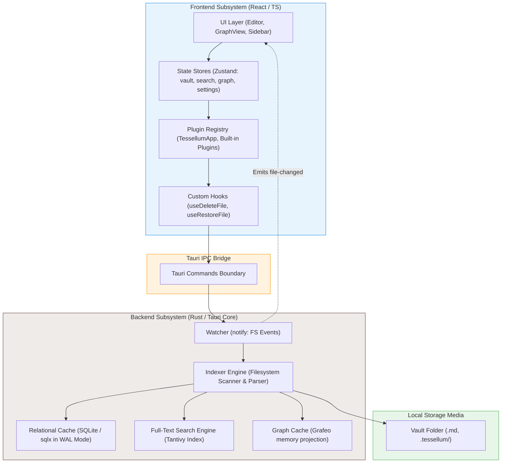
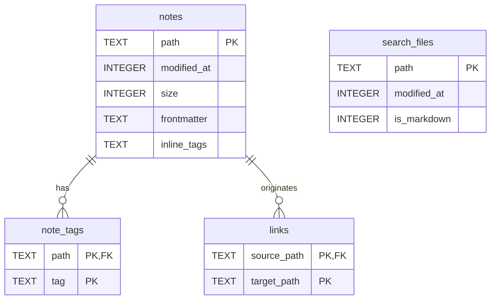
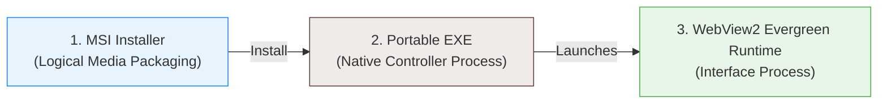

# Documento Nº 6: Otros Documentos Aligned with UNE 157801

## Tessellum: Local-First Knowledge Management & Visualization Platform
**Universidad de Oviedo | Escuela de Ingeniería Informática | Trabajo Fin de Grado**
- **Author**: Jorge Carriles Ruiz
- **Standard Reference**: Aligned with UNE 157801:2014 ("Criterios generales para la elaboración de proyectos de sistemas de información")

---

## 6.1. Objeto y Alcance (Objective and Scope)

### 6.1.1. Objeto del Documento (Document Objective)
Under the **UNE 157001** and **UNE 157801** engineering standards, **Documento Nº 6: Otros Documentos** (Other Documents) serves to justify, catalog, list, and clarify all technical, logical, physical, and media-based concepts expressed throughout the project. It provides an exhaustive repository of structural, operational, and storage information that supports the architectural choices detailed in the **Memoria** (Document 1).

Specifically, this document fulfills three major compliance requirements:
1. **Catálogo de Elementos Constitutivos**: A complete inventory of the constitutive modules, components, services, and schemas that make up the software product.
2. **Listados**: Systematic listings of all program dependencies, libraries, compiler toolchains, and workspace directory structures, ensuring complete reproducibility of the software build.
3. **Información en Soportes Lógicos, Magnéticos, Ópticos u otros**: Technical specification of the media formats used to distribute, run, and persist Tessellum's local-first knowledge base on host systems.

### 6.1.2. Alcance (Scope)
The scope of this document is bounded strictly to the actual, operational implementation of Tessellum as recorded in the active codebase repository. It covers both the frontend React/TypeScript client, the backend Rust/Tauri core system, the SQLite relational metadata cache, the Tantivy full-text search index, the Grafeo graph projection model, and the local file system storage structures.

---

## 6.2. Catálogo de Elementos Constitutivos del Objeto del Proyecto (Catalog of Constitutive Elements)

Tessellum is structured as a local-first desktop application composed of cooperating components distributed across a multi-process architecture. This section catalogs all subsystems, relational schemas, search schemas, syntax representations, and configuration models.

### 6.2.1. Descomposición del Sistema en Subsistemas (System Decomposition)



#### 6.2.1.1. Frontend Subsystem (React / TypeScript)
- **User Interface Layer**: Compiled React component trees rendering the editor canvas, workspace sidebar, file tree, setup launcher, trash manager, settings sheets, and cytoscape knowledge networks.
- **State Orchestration Layer**: Focused, reactive Zustand state stores ([`src/stores/vaultStore.ts`](file:///c:/Users/jorge/Desktop/Uniovi/4/TFG/Tessellum/src/stores/vaultStore.ts), [`src/stores/searchStore.ts`](file:///c:/Users/jorge/Desktop/Uniovi/4/TFG/Tessellum/src/stores/searchStore.ts), [`src/stores/graphStore.ts`](file:///c:/Users/jorge/Desktop/Uniovi/4/TFG/Tessellum/src/stores/graphStore.ts), and [`src/stores/settingsStore.ts`](file:///c:/Users/jorge/Desktop/Uniovi/4/TFG/Tessellum/src/stores/settingsStore.ts)) coordinating client states, caching recent actions, and orchestrating IPC calls.
- **Plugin Registry Subsystem**: Extensibility subsystem managed by the `TessellumApp` and `PluginRegistry` classes, hosting built-in markdown plugins (callouts, math rendering, slash commands `/`, and export outlines).

#### 6.2.1.2. Backend Subsystem (Rust / Tauri Core)
- **Tauri IPC Command Boundary**: Module boundaries exposing asynchronous Rust system functions as IPC command endpoints (`sync_vault`, `watch_vault`, `write_file`, `search_full_text`, `get_graph_data`, `execute_graph_query`, `export_pdf`).
- **Filesystem Watcher Service**: Recursive directory listener implemented via the `notify` crate, invalidating local memory caches and notifying the frontend client of external modifications.
- **Indexer Engine**: High-performance vault scanner that parses modified Markdown notes, extracts tags, resolves inter-note wiki-links, and coordinates SQLite, Tantivy, and Grafeo synchronizations.
- **SQLite Relational Cache**: Embedded relational database managed via `sqlx` in Write-Ahead Logging (WAL) mode, providing immediate transactional cache access for tags, links, and notes.
- **Tantivy Search Indexer**: High-performance, schema-based textual search engine enabling rapid tokenized lookups and search readiness comparisons.
- **Grafeo Graph Projection**: In-memory directed graph structure utilizing the Grafeo crate to cache nodes, outgoing links, and ghost elements for Cypher-style visualization and advanced querying.

---

### 6.2.2. Esquema Relacional de la Base de Datos SQLite (SQLite Database Schema)
The metadata cache is persisted in an embedded SQLite database using the following exact tables, columns, constraints, and index models (defined in [`src-tauri/src/db.rs`](file:///c:/Users/jorge/Desktop/Uniovi/4/TFG/Tessellum/src-tauri/src/db.rs)):



#### 6.2.2.1. Table: `notes`
Stores core metadata and parsed properties for all Markdown files in the active vault.
- `path` (TEXT PRIMARY KEY): The normalized vault-relative file path (uses forward slashes `/`).
- `modified_at` (INTEGER): Unix timestamp (seconds) of the file's last modified time.
- `size` (INTEGER): The physical size of the file on disk in bytes.
- `frontmatter` (TEXT): A JSON string representing parsed YAML frontmatter key-value properties.
- `inline_tags` (TEXT): A JSON string array storing all inline tags (e.g. `#work`, `#idea`) parsed from the note body.

#### 6.2.2.2. Table: `note_tags`
Represents the normalized relationship table mapping notes to their associated tags, supporting rapid, indexed tag searches.
- `path` (TEXT NOT NULL): Foreign key referencing `notes.path` with `ON DELETE CASCADE` and `ON UPDATE CASCADE` constraints.
- `tag` (TEXT NOT NULL): The normalized tag name (without the `#` character).
- **Primary Key**: `PRIMARY KEY (path, tag)`

#### 6.2.2.3. Table: `search_files`
Tracks all physical vault files incorporated into the full-text search model to check index coherence.
- `path` (TEXT PRIMARY KEY): The normalized file path.
- `modified_at` (INTEGER): File modification time at the moment of search indexing.
- `is_markdown` (INTEGER): A boolean flag (1 for Markdown files, 0 for other assets).

#### 6.2.2.4. Table: `links`
Maintains resolved bidirectional links between vault notes to build the knowledge graph and list backlinks.
- `source_path` (TEXT NOT NULL): Foreign key referencing `notes.path` with `ON DELETE CASCADE`.
- `target_path` (TEXT NOT NULL): Normalized destination file path (points to a note that may or may not exist, allowing ghost nodes).
- **Primary Key**: `PRIMARY KEY (source_path, target_path)`
- **Associated Index**: `idx_links_target` ON `links(target_path)` (created to accelerate backlink lookups).

---

### 6.2.3. Esquema del Índice de Búsqueda Tantivy (Tantivy Search Index Schema)
The full-text search engine manages a schema-based directory structure using Tantivy, composed of the following tokenized and stored fields:

| Field Name | Tantivy Data Type | Index Option | Store Option | Role in Tessellum |
|------------|-------------------|--------------|--------------|-------------------|
| `path` | `StrField` | Tokenized (Raw) | Stored | Note's unique identifier path |
| `relative_path` | `StrField` | Untokenized | Stored | Display relative path for hits |
| `title` | `StrField` | Tokenized | Stored | Note header / filename title |
| `body` | `TextField` | Tokenized + Positions | Stored | Raw content body (minus frontmatter) |
| `tags` | `StrField` | Tokenized | Stored | Mapped tags for quick query filtering |
| `modified` | `IntField` | Coarse / Fast | Stored | Time comparison checking |

---

### 6.2.4. Esquema de Sintaxis Markdown Personalizada (Markdown Syntax Schemas)
Tessellum extends basic CommonMark Markdown with three specific structural schemas parsed during note editing and index extraction:

#### 6.2.4.1. Wiki-Links (Enlaces Bidireccionales)
Used to connect thoughts. Outgoing links are parsed from the body using the regex patterns:
- **Default Format**: `[[Target Note]]` -> Resolves to the file `Target Note.md`.
- **Aliased Format**: `[[Target Note|Custom Display Name]]` -> Displays `"Custom Display Name"` in the editor while linking to `Target Note.md`.

#### 6.2.4.2. Callouts (Bloques de Alerta)
Visual callout panels are rendered using blockquote syntax followed by a bracketed identifier:
```markdown
> [!note] Information Title
> This represents an informational callout block.
```
Supported identifiers: `[!note]`, `[!tip]`, `[!important]`, `[!warning]`, `[!caution]`, `[!terminal]`, `[!code]`.

#### 6.2.4.3. YAML Frontmatter Properties
Metadata blocks positioned at the very first line of a note, wrapped in triple dashes (`---`), serialized as JSON:
```yaml
---
title: "Project Alpha Plan"
tags: [feature, alpha]
created: 2026-05-18T15:40:00
author: "Jorge Carriles"
---
```

---

### 6.2.5. Esquemas de Configuración JSON (JSON Configuration Schemas)

#### 6.2.5.1. Global Settings (`settings.json`)
Persistent adjustments stored globally at `%APPDATA%/Tessellum/settings.json`:
```json
{
  "locale": "en",
  "fontSize": 16,
  "spellcheck": true,
  "theme": "dark-premium",
  "recentVaults": ["C:/Users/jorge/Desktop/MyVault"],
  "sidebarWidth": 260
}
```

#### 6.2.5.2. Trash Manifest (`trash_manifest.json`)
Maps deleted notes persisted locally in the `.tessellum/trash/` folder:
```json
{
  "deleted_files": [
    {
      "original_path": "Meetings/Stale Notes.md",
      "trash_filename": "Stale Notes.md.1716045823",
      "deleted_at": 1716045823000
    }
  ]
}
```

---

### 6.2.6. Tabla de Componentes del Código Fuente (Source Code Component Registry)
The following catalog maps the most important source files in the Tessellum workspace to their architectural role, programming language, and estimated size:

| Clickable Target File Link | Subsystem Layer | Programming Language | Core Architectural Responsibility |
|-----------------------------|-----------------|----------------------|-----------------------------------|
| [App.tsx](file:///c:/Users/jorge/Desktop/Uniovi/4/TFG/Tessellum/src/App.tsx) | Frontend Orchestrator | TypeScript (React) | Application bootstrap, IPC event listeners, layout setup |
| [Editor.tsx](file:///c:/Users/jorge/Desktop/Uniovi/4/TFG/Tessellum/src/components/Editor/Editor.tsx) | Frontend UI | TypeScript (React) | CodeMirror 6 canvas setup, line numbering, editing logic |
| [GraphView.tsx](file:///c:/Users/jorge/Desktop/Uniovi/4/TFG/Tessellum/src/components/GraphView/GraphView.tsx) | Frontend UI | TypeScript (React) | Main graph widget mounting Cytoscape rendering and controls |
| [vaultStore.ts](file:///c:/Users/jorge/Desktop/Uniovi/4/TFG/Tessellum/src/stores/vaultStore.ts) | Frontend State | TypeScript | Zustand store managing file lists, tabs, and folder creation |
| [searchStore.ts](file:///c:/Users/jorge/Desktop/Uniovi/4/TFG/Tessellum/src/stores/searchStore.ts) | Frontend State | TypeScript | Zustand store managing search history, query debounce, and warming state |
| [graphStore.ts](file:///c:/Users/jorge/Desktop/Uniovi/4/TFG/Tessellum/src/stores/graphStore.ts) | Frontend State | TypeScript | Zustand store caching node coordinates and Cypher query results |
| [lib.rs](file:///c:/Users/jorge/Desktop/Uniovi/4/TFG/Tessellum/src-tauri/src/lib.rs) | Backend Controller | Rust | AppState configuration, SQLite initialization, command registration |
| [db.rs](file:///c:/Users/jorge/Desktop/Uniovi/4/TFG/Tessellum/src-tauri/src/db.rs) | Backend Storage | Rust | SQL schema migration, transactional upserts, backlink queries |
| [search.rs](file:///c:/Users/jorge/Desktop/Uniovi/4/TFG/Tessellum/src-tauri/src/search.rs) | Backend Search | Rust | Tantivy Indexer coordination, search index warming, query spawning |
| [indexer.rs](file:///c:/Users/jorge/Desktop/Uniovi/4/TFG/Tessellum/src-tauri/src/indexer.rs) | Backend Parser | Rust | Scans folder trees, parses YAML/tags/links, compares timestamps |
| [grafeo_projection.rs](file:///c:/Users/jorge/Desktop/Uniovi/4/TFG/Tessellum/src-tauri/src/grafeo_projection.rs) | Backend Graph | Rust | Grafeo directed memory synchronization and Cypher query execution |
| [watcher.rs](file:///c:/Users/jorge/Desktop/Uniovi/4/TFG/Tessellum/src-tauri/src/commands/watcher.rs) | Backend Watcher | Rust | Spawns `notify` loop threads, debounces disk signals, emits UI alerts |

---

## 6.3. Listados del Proyecto (Project Listings)

This section contains program listings, project dependencies, and folder structures required to compile and reproduce Tessellum under a standard host system environment.

### 6.3.1. Listado de Dependencias del Frontend (package.json)
The following libraries are registered in [`package.json`](file:///c:/Users/jorge/Desktop/Uniovi/4/TFG/Tessellum/package.json) and compile into the client asset bundles:

#### 6.3.1.1. Core Frontend Dependencies
- **`react`** & **`react-dom`** (`^18.3.1`): UI component rendering, virtual DOM diffing, and application lifecycle.
- **`@uiw/react-codemirror`** (`^4.25.4`), **`@codemirror/view`** (`^6.39.11`), **`@codemirror/state`** (`^6.5.4`): Custom CodeMirror 6 markdown editor implementation.
- **`@replit/codemirror-vim`** (`^6.3.0`): Vim keybindings simulation plugin for power typists.
- **`cytoscape`** (`^3.33.1`): Knowledge graph visualization engine supporting layout algorithms and interactive nodes.
- **`react-i18next`** (`^17.0.2`): Internationalization translation registry and dynamic locale switcher.
- **`katex`** (`^0.16.28`): High-speed LaTeX mathematical equation rendering.
- **`mermaid`** (`^11.13.0`): Dynamic flowcharts, sequence diagrams, and class charts parser.
- **`panzoom`** (`^9.4.3`): Smooth panning and zooming viewport control engine for Cytoscape.
- **`lucide-react`** (`^0.562.0`): Sleek vector graphic interface icons.
- **`geist`** (`^1.5.1`): Sleek typography font family.
- **`sonner`** (`^2.0.7`): Premium UI overlay toast notification panel.
- **`zustand`** (`^5.0.10`): Lightweight, hooks-based client state store.
- **`@tauri-apps/api`** (`^2`): System IPC boundary API enabling frontend-to-backend Tauri invokes.

#### 6.3.1.2. Frontend DevDependencies (Compilation & Verification)
- **`typescript`** (`~5.6.2`): Strictly typed JS dialect compile validation.
- **`vite`** (`^6.4.2`): Fast asset bundler and hot-module reloading server.
- **`vitest`** (`^4.1.5`): Unit-testing suite running jsdom mocks.
- **`cypress`** (`^13.12.0`): End-to-end integration and system journey testbeds.
- **`tailwindcss`** (`^4.1.18`): PostCSS-first visual rendering engine.

---

### 6.3.2. Listado de Dependencias del Backend (Cargo.toml)
The following Rust crates are declared in [`Cargo.toml`](file:///c:/Users/jorge/Desktop/Uniovi/4/TFG/Tessellum/src-tauri/Cargo.toml) and compile into the native system controller binary:

- **`tauri`** (`version = "2"`): Core operating system IPC bridge, window creation, and system protocol wrapper.
- **`sqlx`** (`version = "0.8"`, features: `sqlite`, `runtime-tokio`): Asynchronous relational SQLite database access.
- **`tantivy`** (`version = "0.25.0"`): High-speed indexed full-text retrieval database crate.
- **`grafeo`** (`version = "0.5.39"`): Memory directed graph projection and Cypher-style engine.
- **`notify`** (`version = "8.2.0"`): Cross-platform, recursive OS filesystem modification watcher.
- **`serde`** & **`serde_json`** (`version = "1"`): JSON serialization and deserialization helpers.
- **`serde_yaml`** (`version = "0.9.34"`): Frontmatter YAML syntax parser.
- **`walkdir`** (`version = "2.5.0"`): Fast directory tree traverser.
- **`chrono`** (`version = "0.4.43"`): Precise, locale-aware date and time manipulation library.
- **`lopdf`** (`version = "0.40.0"`): Headless PDF document generator (supports outlining and head bookmark mapping).
- **`thiserror`** (`version = "2.0.18"`): Standardized Rust error grouping macro.

---

### 6.3.3. Estructura de Directorios del Espacio de Trabajo (Workspace Layout Tree)
Tessellum organizes its physical workspace structure as follows:

```text
Tessellum/                          # Vault root directory
├── .vscode/                        # Shared IDE configurations
├── cypress/                        # E2E Cypress System Test Specs
│   ├── e2e/                        # User journey specs (*.cy.ts)
│   ├── fixtures/                   # Deterministic seeded vaults
│   └── support/                    # Cypress custom command mocks
├── docs/                           # UNE 157801 Thesis Documentation Chapters
│   ├── architecture/               # Standard specifications & Testing Plans
│   ├── implementation/             # Component blueprints
│   └── qa/                         # Automated test wave guidelines
├── src/                            # Frontend Subsystem Source Code (React / TS)
│   ├── assets/                     # Default themes and styles
│   ├── components/                 # React UI elements
│   │   ├── Editor/                 # Markdown editor (CodeMirror 6 canvas)
│   │   ├── GraphView/              #cytoscape visualization panels
│   │   └── Search/                 # Full-text lookup overlays
│   ├── plugins/                    # Extensibility plugin registries
│   ├── stores/                     # Zustand state store boundaries
│   ├── App.tsx                     # Main orchestrator & entry point
│   └── main.tsx                    # React DOM hook
├── src-tauri/                      # Backend Subsystem Source Code (Rust / Tauri)
│   ├── icons/                      # OS bundle application logos
│   ├── src/                        # Rust system files
│   │   ├── commands/               # Tauri asynchronous handlers
│   │   ├── models/                 # Rust serialized structs
│   │   ├── db.rs                   # SQLite database controller
│   │   ├── indexer.rs              # FS Scanner and frontmatter parser
│   │   ├── grafeo_projection.rs    # Grafeo memory directed graph mapping
│   │   ├── search.rs               # Tantivy index wrapper
│   │   └── lib.rs                  # Rust bootstrapping & command registry
│   ├── tauri.conf.json             # Tauri system capability configurations
│   └── Cargo.toml                  # Backend Rust package manager
├── package.json                    # Frontend Node package manager
├── tsconfig.json                   # TypeScript compiler properties
└── vite.config.ts                  # Vite bundler parameters
```

---

## 6.4. Información en Soportes Lógicos, Magnéticos, Ópticos u otros (Logical, Magnetic, Optical and Other Media)

Tessellum is designed as a local-first system. It stores user knowledge as raw, human-readable Markdown files, while maintaining optimized derived projections on disk. This section details how Tessellum operates across various physical and logical media.

### 6.4.1. Soportes Lógicos (Logical Media / Distributable Bundles)
Tessellum is distributed and executed using digital logical packaging optimized for the target operating system:



- **MSI Installer Package (`Tessellum_0.1.0_x64_en-US.msi`)**: The logical distribution format on Windows. Built using the WiX Toolset via the Tauri compiler, it bundles the application binaries, registers local icons, sets registry values, and ensures the target environment meets execution requirements.
- **Portable Executable File (`Tessellum.exe`)**: The compiled standalone binary. It bootstraps the Rust controller, allocates the native SQLite memory pool, runs the background watcher threads, and spawns the frontend rendering process.
- **WebView2 Evergreen Runtime**: Tessellum delegates visual rendering to the local Microsoft Edge WebView2 runtime library on Windows. This separates the logic process (executing in the native CPU sandbox) from the visual process (executing inside a Chromium rendering container), reducing the distributable size (MSI package is < 15 MB) while preserving elite rendering speeds.

---

### 6.4.2. Soportes Magnéticos y de Estado Sólido (Magnetic & Solid-State Local Storage)
Tessellum relies on solid-state drives (SSDs) or magnetic hard disk drives (HDDs) to persist user data and its derived models. The file system model is strictly divided into two locations on local disk storage:

#### 6.4.2.1. Global Configuration Directory
Global user settings persist across system reboots under the user's OS profile path:
- **Windows Path**: `%APPDATA%/Tessellum/` (resolves to `C:\Users\<username>\AppData\Roaming\Tessellum\`).
- **Files Contained**:
  - `settings.json`: Stores global UI configurations, theme selection, and vault history.

#### 6.4.2.2. Vault Configuration Directory (`.tessellum/`)
To preserve vault portability, Tessellum writes all application-derived models, metadata caches, and temp files inside an isolated, hidden folder `.tessellum` created at the root of the active vault directory selected by the user.

```text
Vault Root Directory/
├── Note 1.md                       # Raw, human-readable user knowledge
├── Note 2.md
├── .tessellum/                     # Application hidden cache folder
│   ├── trash/                      # Active Trash repository
│   │   ├── trash_manifest.json     # Deletion states manifest
│   │   ├── DeletedNote.md.1716...  # Trashed files with timestamp suffixes
│   │   └── ...
│   ├── index/                      # Tantivy full-text index database
│   │   ├── meta.json               # Tantivy schema and active segment map
│   │   ├── *.idx, *.store          # Segment data files
│   │   └── ...
│   ├── themes/                     # Local custom user themes
│   │   └── premium-custom.json
│   ├── tessellum.db                # SQLite Relational Database Cache
│   ├── tessellum.db-wal            # SQLite Write-Ahead Log file
│   └── tessellum.db-shm            # SQLite Shared-Memory file
```

##### SQLite Write-Ahead Logging (WAL) Architecture Note
In the local storage media, SQLite is configured in **WAL (Write-Ahead Log) mode**. This means:
1. When notes are edited, SQLite does not write directly to the primary database file `tessellum.db`. Instead, changes are appended to the WAL file `tessellum.db-wal`.
2. This allows concurrent read transactions (e.g. search queries, Cytoscape graph renders, backlink lists) to execute without blocking or being blocked by write transactions (e.g. background indexing, file watch sync).
3. The shared-memory file `tessellum.db-shm` is created dynamically to coordinate memory lookups across WAL index blocks.

##### Tantivy Index Storage Note
The `.tessellum/index/` directory stores Tantivy's inverted index segments. It contains term dictionaries, posting lists, and document stores in compact, read-optimized binary formats, enabling sub-millisecond search queries over local SSD/HDD storage.

##### Trash Retention Storage Note
When notes are trashed, they are moved to the local `.tessellum/trash/` folder on disk and appended with a Unix timestamp suffix. This ensures files are never lost, and if the user restores a file, Tessellum uses `trash_manifest.json` to move the note back to its original path.

---

### 6.4.3. Soportes Ópticos, Copias de Seguridad e Intercambio (Optical, Back-up and Exchange Media)

#### 6.4.3.1. Knowledge Portability and Exchange
Because Tessellum keeps the vault as the absolute source of truth (saving notes as standard, plain-text Markdown files), **the entire vault is highly portable**.
- **Data Exchange**: Users can copy their entire vault folder to removable magnetic media (USB flash drives, external HDDs), optical media (CD-R, DVD-R, Blu-ray discs), or network storage (Google Drive, Dropbox, local NAS) without any dependency on Tessellum database files.
- **Zero Lock-In**: If a user ceases to use Tessellum, their notes remain open, human-readable, and fully editable in any text editor or other Markdown knowledge tools. The `.tessellum/` cache folder can be deleted at any time, and Tessellum will automatically reconstruct it upon re-opening the vault.

#### 6.4.3.2. Outward Printable Formats (Optical & Exchange Outputs)
For formal academic, professional, or digital exchanges, Tessellum implements a headless PDF export flow:
- **Headless Exporter Output**: Renders markdown notes with outlining outlines, custom theme colors, math notations (KaTeX), and embedded outlines directly into standard `.pdf` document files.
- **Distribution**: These output PDFs are fully standardized and can be easily written to optical exchange media or attached to electronic mail systems for thesis submissions and academic reviews.

---

## 6.5. Síntesis Documental (Document Synthesis)

**Documento Nº 6: Otros Documentos** forms the final, coordinating chapter of Tessellum's software documentation package under the **UNE 157801** engineering standard. 

By cataloging the exact frontend and backend subsystems, documenting the precise schemas of the SQLite relational cache, Tantivy index, and YAML frontmatter properties, listing all software dependencies from `package.json` and `Cargo.toml`, and outlining the logical installer boundaries and solid-state/magnetic storage paths (such as the WAL-configured SQLite file buffers), this document guarantees that the software design is fully justified, auditable, and completely reproducible.

Tessellum's architecture honors local-first engineering principles: it uses local derived projections to optimize search and visualization speeds, while safeguarding user data portability on raw local storage media.
